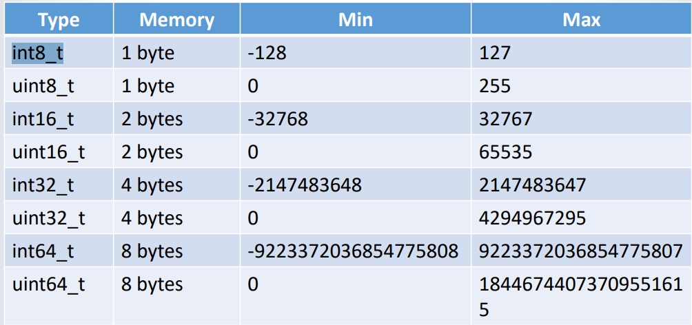

# Week1

# The roles of C and C++

* C is important because it was developed explicitly as  an alternative to assembler.（汇编的替代品）
* This means it has the properties that:

  * The language and compiler add very little overhead to the code（编译器和语言本身对代码几乎没有额外的开销）
  * The code maps very closely to machine code.（紧密地映射到机器代码）
  * The additional run-time code made necessary by the language is relatively small.
* C++ generally shares these properties but reduces them somewhat because object orientation is intrinsically alien to machine code.

# Uses of C and C++

* **High performance**: Because of their **low overhead**, C and C++ can often be **more** **efficiently compiled** than most other languages.
* **Small systems**: Systems with restricted amounts of memory or slower CPUs also benefit from reduced overhead in the language（占用计算机资源较少）
* **Security**: While writing secure code in C and C++ is difficult, knowing exactly what the computer is doing at any given time is often highly beneficial to security.（更容易地管理内存分配和释放，避免缓冲区溢出等常见的安全漏洞）

# Security issue

1. **Legacy Code**: C is a very**​ old programming language**, and there are vast amounts of legacy code written in C that are still in use today. Many of these **older codebases** were developed before modern security practices were widely adopted, and they may contain vulnerabilities that have never been addressed.
2. **Manual Memory Management**: C allows for manual memory management, which can be error-prone. Memory-related vulnerabilities like buffer overflows, null pointer dereferences, and memory leaks are common in C code when developers do not exercise caution. These issues can lead to security vulnerabilities.
3. **Lack of Built-in Safety Features**: C is a low-level language that provides minimal built-in safety features. While this gives programmers a high degree of control over the hardware, it also means that they must be very careful to avoid security pitfalls. In contrast, higher-level languages have more safety features built in, which can help prevent certain types of security issues.

# A basic C program

```C
#include <stdio.h>
int main() {
puts(“Hello World!\n”);
return 0;
}
```

1. `#include <stdio.h>`​

    这是一个预处理指令，它告诉编译器包含名为 "stdio.h" 的标准输入/输出头文件。这个头文件包含了用于输入和输出的函数、变量和其他定义。
2. `int main() {`​

    这是程序的主函数的开始。C程序通常从 `main`​ 函数开始执行。`int`​ 表示 `main`​ 函数将返回一个整数值，`main`​ 后的小括号 `()`​ 表示函数不带任何参数。
3. `puts("Hello World!\n");`​

    这是 `main`​ 函数的主体部分。这一行使用 `puts`​ 函数将字符串 "Hello World!\n" 输出到标准输出设备（通常是终端或命令行窗口）。`puts`​ 是一个用于输出字符串的标准C库函数。`\n`​ 是一个转义序列，表示换行符，用于在字符串末尾创建一个新行。
4. `return 0;`​

    这是 `main`​ 函数的最后一行，它表示函数的返回值为0。在C中，返回0通常表示程序成功执行。在这个简单的程序中，返回值并不是严格必需的，但它是一种常见的做法，以指示程序的执行状态。
5. `}`​

    这是 `main`​ 函数的结束标志，表示主函数的代码块结束。

整个程序的功能非常简单，它只是输出 "Hello World!\n" 到标准输出，然后返回0，表示成功执行。

同理，C++的示例如下：

```C
#include <iostream>
using std::cout;
using std::endl;
int main() {
cout << “Hello World!” << endl;
return 0;
}
```

* C++程序使用 `#include <iostream>`​ 来包含标准输入/输出流的头文件。C++中，输入输出通常使用流（stream）来进行，而不是C中的标准库函数。
* 使用了命名空间来管理标准库函数和对象。例如，`using std::cout;`​ 和 `using std::endl;`​ 语句将 `cout`​ 和 `endl`​ 引入了当前作用域，以便直接使用它们，而不必在每次使用时加上前缀 `std::`​。

* C程序使用 `puts`​ 函数来输出字符串。
* C++程序使用 `cout`​ 对象，通过 `<<`​ 操作符来输出字符串和其他数据类型。这种方式被认为更具有面向对象的特性，允许更多的格式化和控制输出

# A Simple Loop

```C
#include <stdio.h>
#include <stdint.h>
int main() {
	for (uint8_t x=0; x<10; x++) {
		printf(“%i\n”,x);
	}
	return 0;
}
```

使用一个 `for`​ 循环来打印从0到9的整数，每个整数占一行。

1. `#include <stdio.h>`​ 和 `#include <stdint.h>`​：这两行是预处理指令，用于包含标准输入/输出和整数类型头文件。
2. `int main()`​：这是程序的主函数。C程序通常从 `main`​ 函数开始执行，它返回一个整数值，表示程序的执行状态。
3. `for (uint8_t x = 0; x < 10; x++)`​：这是一个 `for`​ 循环，它初始化一个名为 `x`​ 的 `uint8_t`​ 类型的循环变量，将其从0递增到9，每次递增1。
4. `{`​ 和 `}`​：这些大括号包围了 `for`​ 循环的循环体，其中包含要重复执行的代码块。
5. `printf("%i\n", x);`​：在循环体内，使用 `printf`​ 函数来打印当前值 `x`​，`%i`​ 是格式说明符，表示要打印的是整数，`\n`​ 表示换行，以在每次迭代后将输出移到下一行。
6. `return 0;`​：最后，`main`​ 函数返回整数值0，表示程序成功执行。这是C程序的一种常见约定，通常表示一切正常。

# Interger standard types

1. `**int8_t**`​：一个有符号的8位整数。

    * 范围大约在-128到128之间。

2. **`int16_t`**​：有符号的16位整数。

* 范围大约在-32,768到32,767之间。
* 通常用于需要节省内存或确切控制整数大小的应用程序。

3. **`int32_t`**​：有符号的32位整数。

* 范围大约在-2,147,483,648到2,147,483,647之间。
* 是C语言中最常用的整数类型之一。

4. **`int64_t`**​：有符号的64位整数。

* 范围大约在-9,223,372,036,854,775,808到9,223,372,036,854,775,807之间。
* 用于存储非常大范围的整数。

5. **`uint8_t`**​：无符号的8位整数。

* 范围大约在0到255之间。
* 用于表示非负整数，不包括负数。

6. **`uint16_t`**​：无符号的16位整数。

* 范围大约在0到65,535之间。
* 通常用于需要节省内存或确切控制整数大小的无符号整数。

7. **`uint32_t`**​：无符号的32位整数。

* 范围大约在0到4,294,967,295之间。
* 用于表示较大范围的非负整数。

8. **`uint64_t`**​：无符号的64位整数。

* 范围大约在0到18,446,744,073,709,551,615之间。
* 用于存储非常大范围的无符号整数。



# C语言中的占位符

C语言中的占位符是用于指示在格式化输出中插入变量值的特殊标记。这些占位符以百分号（%）开头，后面跟着一个字符，表示不同类型的数据应该在输出中的位置。以下是一些常见的C语言占位符及其示例：

1. **%d 或 %i**（整数占位符）：

    * 用于插入整数值。
    * 示例：

      ```c
      int age = 25;
      printf("年龄：%d岁\n", age);
      ```
2. **%f**（浮点数占位符）：

    * 用于插入浮点数值。
    * 示例：

      ```c
      float price = 19.99;
      printf("价格：$%.2f\n", price);
      ```
3. **%c**（字符占位符）：

    * 用于插入字符。
    * 示例：

      ```c
      char grade = 'A';
      printf("等级：%c\n", grade);
      ```
4. **%s**（字符串占位符）：

    * 用于插入字符串。
    * 示例：

      ```c
      char name[] = "Alice";
      printf("姓名：%s\n", name);
      ```
5. **%p**（指针占位符）：

    * 用于插入指针的地址。
    * 示例：

      ```c
      int num = 42;
      int *ptr = &num;
      printf("指针地址：%p\n", (void *)ptr);
      ```
6. **%x 或 %X**（十六进制占位符）：

    * 用于插入整数值的十六进制表示。
    * 示例：

      ```c
      int hexValue = 0xA5;  // 十六进制表示
      printf("十六进制值：%x\n", hexValue);
      ```
7. **%%**（百分号占位符）：

    * 用于插入百分号字符本身。
    * 示例：

      ```c
      printf("这是一个百分号符号：%%\n");
      ```

# Loop

## **C**

1. **for循环**：`for`​ 循环是C语言中最常用的循环结构之一，用于按照指定的条件和计数器来重复执行代码块。语法如下：

    ```c
    for (初始化; 条件; 更新) {
        // 循环体
    }
    ```

    示例：

    ```c
    for (int i = 0; i < 5; i++) {
        printf("%d\n", i);
    }
    ```
2. **while循环**：`while`​ 循环根据指定的条件重复执行代码块，只要条件为真。语法如下：

    ```c
    while (条件) {
        // 循环体
    }
    ```

    示例：

    ```c
    int x = 0;
    while (x < 5) {
        printf("%d\n", x);
        x++;
    }
    ```
3. **do-while循环**：`do-while`​ 循环首先执行一次循环体，然后根据指定的条件重复执行，只要条件为真。语法如下：

    ```c
    do {
        // 循环体
    } while (条件);
    ```

    示例：

    ```c
    int y = 0;
    do {
        printf("%d\n", y);
        y++;
    } while (y < 5);
    ```

## **C++**

C++继承了C语言的循环结构，并且还引入了一些额外的循环类型和功能。

1. **for循环**：C++中的 `for`​ 循环与C语言中的相同。
2. **while循环**：C++中的 `while`​ 循环也与C语言中的相同。
3. **do-while循环**：C++中的 `do-while`​ 循环也与C语言中的相同。
4. **范围-based for循环**：C++引入了范围-based for循环，用于迭代数组、容器和其他可迭代对象的元素。语法如下：

    ```cpp
    for (数据类型 变量 : 可迭代对象) {
        // 循环体
    }
    ```

    示例：

    ```cpp
    int numbers[] = {1, 2, 3, 4, 5};
    for (int num : numbers) {
        cout << num << endl;
    }
    ```
5. **循环控制语句**：C++中引入了额外的循环控制语句，如 `break`​（跳出循环）和 `continue`​（跳过当前迭代）。

# Input

在C和C++中，可以使用标准库函数来进行输入操作。以下是在C和C++中进行输入的基本方法：

**在C中的输入：**

1. **使用**​**`scanf`**​**函数**：`scanf`​ 函数用于从标准输入（通常是键盘）读取数据并将其存储在变量中。你需要提供格式字符串，指示如何解析输入数据。例如，要读取整数，你可以使用 `%d`​ 格式说明符：

    ```c
    #include <stdio.h>
    
    int main() {
        int num;
        printf("请输入一个整数：");
        scanf("%d", &num); // 从键盘读取整数，并存储在num变量中
        printf("你输入的整数是：%d\n", num);
        return 0;
    }
    ```
2. **使用**​**`gets`**​**函数和**​**`fgets`**​**函数**：这些函数用于读取字符串（一行或多行文本）。然而，它们在C中不太安全，因为它们无法防止缓冲区溢出。建议使用 `fgets`​ 并注意控制输入的长度。

    ```c
    #include <stdio.h>
    
    int main() {
        char buffer[100];
        printf("请输入一行文本：");
        fgets(buffer, sizeof(buffer), stdin); // 从键盘读取一行文本
        printf("你输入的文本是：%s", buffer);
        return 0;
    }
    ```

**在C++中的输入：**

1. **使用**​**`cin`**​**对象**：C++引入了 `cin`​ 对象用于输入操作，它与 `cout`​ 对象一样方便。你可以使用 `>>`​ 操作符从键盘读取数据并将其存储在变量中。例如，要读取整数，可以这样做：

    ```cpp
    #include <iostream>
    
    int main() {
        int num;
        std::cout << "请输入一个整数：";
        std::cin >> num; // 从键盘读取整数，并存储在num变量中
        std::cout << "你输入的整数是：" << num << std::endl;
        return 0;
    }
    ```
2. **使用**​**`getline`**​**函数**：如果要读取一行文本，可以使用 `getline`​ 函数。这个函数可以安全地读取一行或多行文本，无需担心缓冲区溢出问题。

    ```cpp
    #include <iostream>
    #include <string>
    
    int main() {
        std::string line;
        std::cout << "请输入一行文本：";
        std::getline(std::cin, line); // 从键盘读取一行文本
        std::cout << "你输入的文本是：" << line << std::endl;
        return 0;
    }
    ```

`


